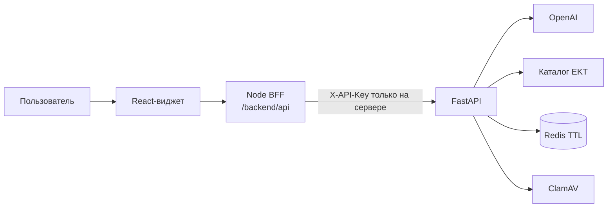
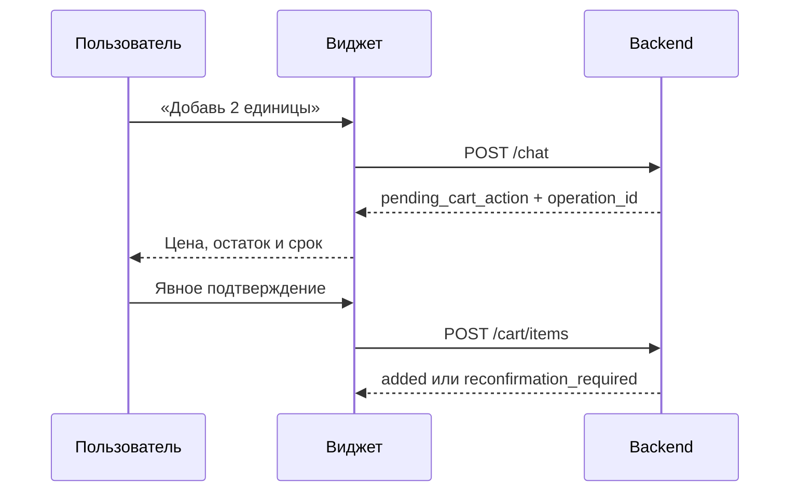

# EKT x Kochshi

## ИИ-ассистент по электротехнике

[](https://react.dev/)
[](https://fastapi.tiangolo.com/)
[](https://www.typescriptlang.org/)
[](#качество-и-проверки)

Полноценный AI-консультант для сайта **ekt.kz**. Ассистент понимает запрос
обычным языком, ищет электротехнические товары, сравнивает аналоги, разбирает
фотографии и спецификации и безопасно добавляет выбранную позицию в
демонстрационную корзину.

Репозиторий содержит весь проект:

- React-виджет и презентационную страницу;
- same-origin BFF на Node.js;
- backend на FastAPI;
- Redis для временных сессий;
- профиль ClamAV для проверки вложений;
- frontend- и backend-тесты.

> Локальная папка `backend/` игнорируется Git: это может быть дополнительный
> checkout для разработки. Backend проекта уже находится в корневых папках
> `app/`, `tests/` и файлах Docker.

---

## Проект за 30 секунд

### Проблема

В каталоге электротехники тысячи похожих товаров и технических параметров.
Покупателю приходится знать точный артикул, вручную сравнивать характеристики и
проверять остатки. Ошибка в номинале или совместимости приводит к потере времени.

### Решение

Strikers Club превращает поиск в диалог:

1. Пользователь описывает задачу или прикладывает документ.
2. AI находит товары в реальном каталоге EKT.
3. Интерфейс показывает цену, остаток, параметры и отличия аналогов.
4. Перед изменением корзины пользователь видит точное предложение.
5. Товар добавляется только после явного подтверждения.

### Польза

| Покупателю                  | Бизнесу                             | Команде                   |
| --------------------------- | ----------------------------------- | ------------------------- |
| Поиск без знания каталога   | Меньше потерянных обращений         | Встраиваемый React-виджет |
| Понятное сравнение аналогов | Быстрее путь от вопроса к товару    | Строгий API-контракт      |
| Работа с фото и документами | Консультация 24/7                   | Ключи остаются на сервере |
| Контроль перед корзиной     | Безопасный UX без случайной покупки | Полный набор автотестов   |

---

## Возможности

- поиск по названию, артикулу и техническому описанию;
- свежая карточка товара с ценой, остатками и характеристиками;
- подбор аналогов с совпадениями, отличиями и неизвестными параметрами;
- внешние варианты с обязательной пометкой «требует проверки»;
- JPEG, PNG, PDF, DOCX и XLSX до 20 МБ;
- отображение распознанных позиций и уверенности извлечения;
- серверное предложение на добавление товара;
- подтверждение по уникальному `operation_id`;
- идемпотентный повтор после потери сетевого ответа;
- временная гостевая сессия с TTL;
- понятное восстановление после истечения сессии;
- автономный demo-режим для презентации без backend.

---

## Демонстрация для хакатона

Откройте [http://localhost:5173](http://localhost:5173) и нажмите круглую кнопку
чата в правом нижнем углу.

Сценарий на 2–3 минуты:

1. Спросите: **«Найди кабель ВВГнг 3×2,5»**.
2. Покажите карточку и откройте «Подробнее».
3. Попросите подобрать аналог и покажите явные отличия.
4. Напишите: **«Добавь 1 единицу товара с ID 515291 в корзину»**.
5. Покажите, что до подтверждения корзина не изменилась.
6. Подтвердите предложение и откройте внутреннюю демо-корзину.
7. Приложите фото или спецификацию при запущенном ClamAV.

Корзина демонстрационная: заказ и резерв на ekt.kz не создаются.

---

## Архитектура



### Зачем нужен BFF

Браузер не получает серверный `API_KEY`. Запросы идут на тот же origin через
`/backend/api/*`, а BFF:

- добавляет backend-ключ;
- передаёт токен гостевой сессии;
- разрешает только известные маршруты и методы;
- проверяет origin и Content-Type;
- ограничивает JSON до 16 КиБ и файл до 20 МиБ;
- устанавливает timeout 120 секунд;
- возвращает `request_id` для диагностики;
- запрещает кеширование API.

Session token хранится только в памяти клиента. Он не записывается в Redux,
`localStorage`, URL или логи.

---

## Технологии

| Слой             | Технологии                                       |
| ---------------- | ------------------------------------------------ |
| Frontend         | React 19, TypeScript, Vite, Material UI, Emotion |
| State            | Redux Toolkit, TanStack Query                    |
| BFF              | Node.js HTTP server, Vite middleware             |
| Backend          | Python 3.11+, FastAPI, Pydantic                  |
| AI и каталог     | OpenAI Responses API, EKT API                    |
| Временные данные | Redis с TTL                                      |
| Вложения         | ClamAV INSTREAM                                  |
| Тесты            | Vitest, Testing Library, Pytest                  |
| Качество         | ESLint, Prettier, Ruff, MyPy                     |

---

## Быстрый запуск

### Требования

- Node.js **22.12+**;
- npm;
- Docker и Docker Compose;
- ключ OpenAI;
- доступ к EKT API.

### 1. Настройте окружение

Linux/macOS:

```bash
cp .env.example .env
```

Windows PowerShell:

```powershell
Copy-Item .env.example .env
```

Заполните в `.env`:

```dotenv
API_KEY=случайный_секрет_длиной_не_менее_32_символов
OPENAI_API_KEY=ваш_openai_key
EKT_API_USER=логин_ekt
EKT_API_PASSWORD=пароль_ekt

VITE_API_MODE=live
VITE_API_BASE_URL=/backend/api
BACKEND_URL=http://127.0.0.1:8000
BACKEND_API_PREFIX=/api
```

Для генерации `API_KEY`:

```bash
python -c "import secrets; print(secrets.token_urlsafe(48))"
```

Не добавляйте секреты в переменные с префиксом `VITE_`: они доступны браузеру.
`.env` и `.env.local` исключены из Git.

### 2. Запустите backend

С поддержкой файлов:

```bash
docker compose --profile uploads up --build -d
```

Только текстовый чат:

```bash
docker compose up --build -d
```

Проверьте readiness:

```bash
curl http://127.0.0.1:8000/api/health/ready
```

Ожидаемый ответ:

```json
{ "status": "ok", "redis": "ok" }
```

### 3. Запустите frontend

```bash
npm install
npm run dev
```

Откройте [http://localhost:5173](http://localhost:5173).

Vite читает корневой `.env`, но передаёт в браузер только `VITE_*`. Значение
`API_KEY` использует серверная часть BFF.

---

## Demo без backend

Если для презентации нет внешних ключей, создайте `.env.local`:

```dotenv
VITE_API_MODE=demo
```

Затем:

```bash
npm install
npm run dev
```

Demo использует только синтетические данные. При сбое live-backend приложение
не переключается в demo автоматически, поэтому проблемы интеграции остаются видимыми.

---

## Адреса

| Сервис                | Адрес                                                                                            |
| --------------------- | ------------------------------------------------------------------------------------------------ |
| Frontend              | [http://localhost:5173](http://localhost:5173)                                                   |
| BFF readiness         | [http://localhost:5173/backend/api/health/ready](http://localhost:5173/backend/api/health/ready) |
| Backend               | `http://127.0.0.1:8000`                                                                          |
| Backend readiness     | `http://127.0.0.1:8000/api/health/ready`                                                         |
| Swagger в development | [http://localhost:8000/docs](http://localhost:8000/docs)                                         |

Swagger использует backend `API_KEY`. В production Swagger и OpenAPI отключены.

---

## Основные переменные окружения

| Переменная                         | Назначение                                               |
| ---------------------------------- | -------------------------------------------------------- |
| `API_KEY`                          | Авторизация BFF в FastAPI                                |
| `OPENAI_API_KEY`                   | Доступ к OpenAI                                          |
| `EKT_API_USER`, `EKT_API_PASSWORD` | Доступ к каталогу                                        |
| `REDIS_URL`                        | Хранилище временных сессий                               |
| `UPLOAD_SCAN_HOST`                 | Host ClamAV; для Compose — `clamav`                      |
| `VITE_API_MODE`                    | `live` или явный `demo`                                  |
| `VITE_API_BASE_URL`                | Путь браузера к BFF                                      |
| `BACKEND_URL`                      | Origin FastAPI для BFF                                   |
| `BACKEND_API_PREFIX`               | Обычно `/api`                                            |
| `BACKEND_API_KEY`                  | Отдельный BFF-ключ; пустое значение использует `API_KEY` |
| `PUBLIC_ORIGIN`                    | Точный origin за reverse proxy                           |

Полный список и безопасные значения по умолчанию находятся в
[.env.example](.env.example).

---

## HTTP API

| Метод | Путь                            | Назначение                 |
| ----- | ------------------------------- | -------------------------- |
| POST  | `/api/chat/sessions`            | Создать гостевую сессию    |
| POST  | `/api/chat`                     | Отправить текст            |
| POST  | `/api/chat/upload?session_id=…` | Отправить файл сырым телом |
| GET   | `/api/products/{product_id}`    | Получить свежую карточку   |
| GET   | `/api/cart?session_id=…`        | Получить демо-корзину      |
| POST  | `/api/cart/items`               | Подтвердить предложение    |
| GET   | `/api/health/live`              | Проверить процесс          |
| GET   | `/api/health/ready`             | Проверить FastAPI и Redis  |

Подробные контракты:

- [интеграция frontend](docs/FRONTEND_INTEGRATION.md);
- [контракт чата](docs/CHAT_API.md);
- [техническая спецификация backend](docs/BACKEND_TECHNICAL_SPECIFICATION.md).

---

## Безопасное подтверждение корзины



- Новое предложение заменяет старое.
- Отмена отправляется backend сообщением «отмена».
- При изменении цены или остатка нужен новый клик.
- Повтор одного `operation_id` не добавляет товар второй раз.
- `cart_url` — защищённый API-путь, а не checkout-ссылка.
- Корзина всегда отмечена как демонстрационная.

---

## Структура

```text
.
├── app/                # FastAPI backend
├── tests/              # backend-тесты
├── docs/               # API и техническая документация
├── src/
│   ├── api/            # TypeScript-клиент и runtime-валидация
│   ├── components/     # чат, карточки и диалоги
│   ├── hooks/          # сессия, сообщения, файлы и корзина
│   ├── state/          # Redux state
│   └── styles/         # стили виджета и preview
├── server/             # Node BFF и static server
├── docker-compose.yml
├── Dockerfile
├── package.json
└── .env.example
```

Локальная дублирующая папка `backend/` намеренно исключена из Git.

---

## Команды frontend

| Команда                | Назначение                        |
| ---------------------- | --------------------------------- |
| `npm run dev`          | Vite development server с BFF     |
| `npm test`             | Все frontend- и BFF-тесты         |
| `npm run typecheck`    | TypeScript                        |
| `npm run lint`         | ESLint                            |
| `npm run format:check` | Prettier                          |
| `npm run build`        | Preview + widget + Node server    |
| `npm start`            | Production Node BFF/static server |

## Команды backend

```bash
docker compose --profile uploads up --build -d
docker compose logs -f api
docker compose down
pytest
ruff check app tests
mypy app
```

---

## Production-сборка frontend

```bash
npm ci
npm run build
npm start
```

Сборка создаёт:

- `dist/preview` — презентационную страницу;
- `dist/widget` — встраиваемый виджет и CSS;
- `dist/server` — Node BFF и static server.

За HTTPS reverse proxy направьте `/backend/api/*` на Node-сервер, разрешите
тела до 20 МиБ и установите upstream timeout не меньше 120 секунд.

---

## Встраивание виджета

```tsx
import AssistantWidget from './dist/widget/ekt-assistant.js';
import './dist/widget/ekt-ai-assistant.css';

export function App() {
  return <AssistantWidget mode="live" apiBaseUrl="/backend/api" initiallyOpen={false} />;
}
```

Хост-приложение должно предоставить BFF по указанному same-origin пути.

---

## Качество и проверки

Frontend проверяет критические интеграционные сценарии:

- сессия создаётся один раз;
- upload и текст выполняются последовательно;
- успешный upload не повторяется после частичного сбоя;
- старое предложение нельзя подтвердить после замены;
- двойной клик не создаёт две операции;
- потерянное подтверждение повторяется тем же payload;
- `cart: null` не стирает корзину;
- decimal-строки отображаются без потери точности;
- BFF проверяет ключ, token, origin, маршрут, размер и timeout.

Последняя frontend-проверка:

```text
19 test files passed
147 tests passed
TypeScript passed
ESLint passed
Prettier passed
Production build passed
```

Полная проверка frontend:

```bash
npm run typecheck
npm run lint
npm run format:check
npm test
npm run build
```

Backend имеет отдельный набор Pytest-тестов с mock внешних интеграций.

---

## Ограничения прототипа

- Корзина не создаёт заказ и резерв на ekt.kz.
- Сессия, история и корзина исчезают после TTL или перезапуска Redis.
- Вложения не сохраняются backend на диск.
- Для файлов требуется готовый ClamAV.
- Healthcheck не гарантирует доступность OpenAI, EKT и сканера.
- Внешние варианты нельзя подтверждать как каталожный товар.

Ограничения явно показаны в интерфейсе. Live-ошибки не маскируются автоматическим
переключением на demo.

---

## Статус

Полный сценарий проверен с реальным backend: создание сессии, получение товара,
предложение, подтверждение демонстрационной корзины и загрузка файла через ClamAV.
